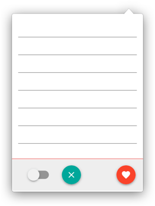
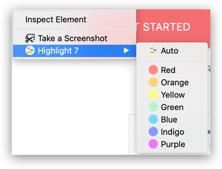
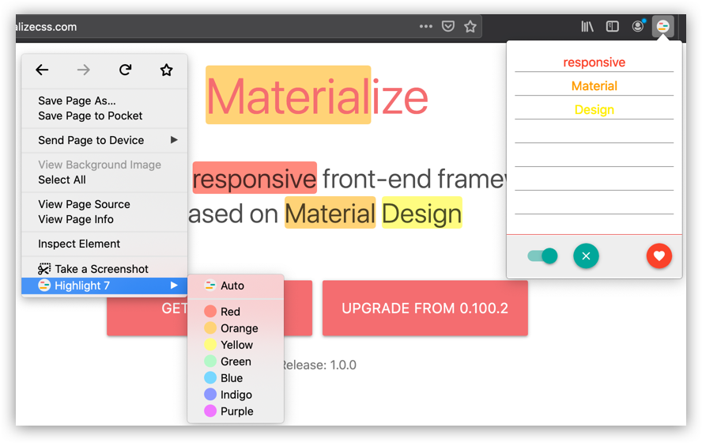

## Introduction

Highlight 7 is a browser add-on gives you better text browser experience. Now supports Firefox, maybe port it to Chrome and Edge later.

- If you wanna try it, search `Highlight 7` on Firefox addon market.
- If you wanna contribute, take a loot at [Github](https://github.com/xenkuo/highlight-7-firefox).
- If you wanna donate to `Highlight 7`, please turn to [Donation](../2020-01-01-donation/) page.

To ease the operation, it implemented three user interfaces:

- Popup page
- Context menu
- Shortcut

Recommend you try shortcut method, you can even use it to browser source code! Here defined 3 shortcuts:

- highlight with auto color: alt/cmd+shift+2
- enable/disable highlight: alt/cmd+shift+e
- clear highlight: alt/cmd+shift+x

## Screenshots

##### Popup page

{: .center-block :}

##### Context menu

{: .center-block :}

##### Overview

{: .center-block :}

## The End

Wish you enjoy it.
