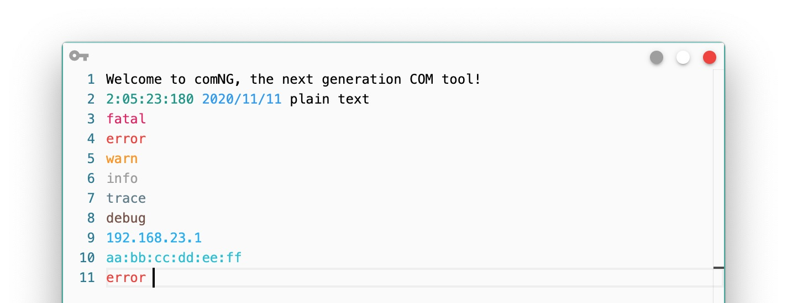
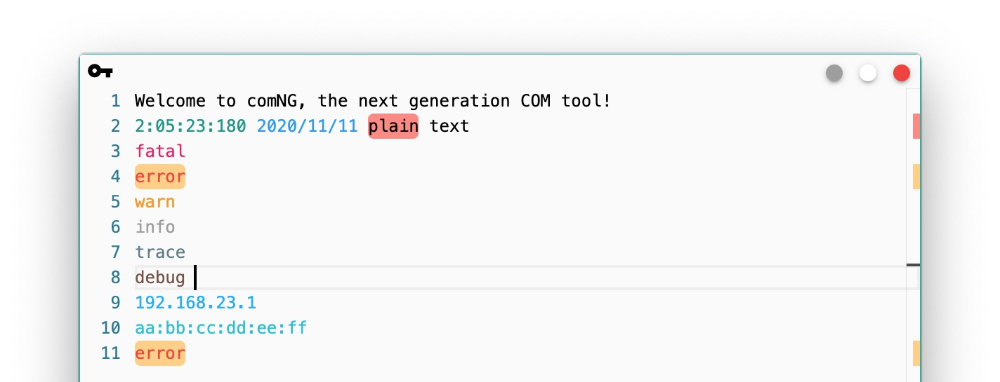
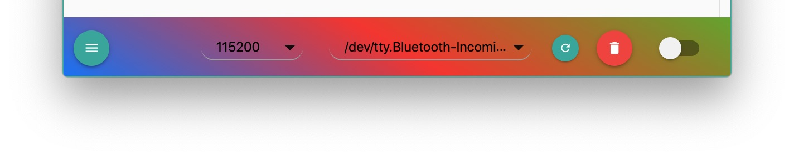
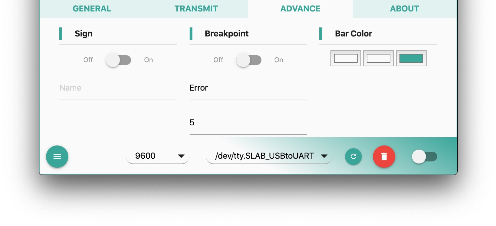

### Design Principle

- the simpler, the better
- stable and professional
- modern UI and user friendly

### Introduction

**comNG** focus on serialport communication and best **on-site data explore**. Yes, we created the word: **on-site data explore**. comNG implemented several features to help you explore log without copy it to other editors. These features including:

- built-in comNGLang syntax
- built-in word highlighter
- globally highlight word you selected (monaco built-in)
- globally highlight word you searched (monaco built-in)
- breakpoint on certain text
- timestamp append and name sign

Of course it supports common features that other COM tools have:

- baud rate customize
- hex receive
- configuration of 8N1
- receive timestamp
- text transmit
- file save and open, drag-drop is supported

Features not supported:

- hex transmit
- flow control
- file transmit
- capture to file

By the way comNG owns an **UNIBODY** look and feel and customizable bar theme, wish it's pretty enough to deserve you :).

Finally comNG uses MIT licence.

### Download

[github release](https://github.com/xenkuo/comNG/releases)

[sourceforge release](https://sourceforge.net/projects/comng/)

### The Color

##### Built-in comNGLang syntax

comNG uses **monaco** editor as the text render, **vscode** use monaco as well. Its powerful language highlighter give us a colorful view. Based on monaco, we defined a language: **comNGLang**. If your log takes syntax of comNGLang, it will automatically highlighted, without any decorated chars in raw output.

All the color rendered automatically, no decorated chars. Please refer to [comNGLang Spec](../2019-08-03-comNGLang/) for syntax definition.

##### Built-in Word Highlighter

You may noticed that I made a highlighter add-on to firefox, it can highlight word you selected. I implemented same feature in comNG. Select the word you are interested, right click mouse and select `Highlight Toggle`, that's all. All the same words in current log will be highlighted and even more in right scroll bar, you get a position distribution overview.

You can use shortcut `Ctrl/Cmd + E` as well.

Take the same action on a highlighted word will remove highlight effect.

##### Monaco built-in highlighter

Monaco editor supports selected word globally highlight and searched word globally highlight. You can easily find the position of highlighted words with right scroll bar.

##### Customizable bar theme

This feature may be not necessary, but I can't find a satisfied bar theme, then I make it customable.

Make the theme by yourself. The configuration lies in `ADVANCED` tab, it's quit easy to customize and supports real time preview.

### Advance Features

##### Sign

You may want to insert timestamp to your log file. Turn on **Sign** feature, that will be done automatically. comNG will insert below line at first line of log when you click clean log button:

`Captured at 1/1/2019, 19:19:19 PM with comNG by Xen.`

And the saved file will be named as:

`Log-2019-01-01T19-19-19-335Z-Xen.cnl`

`cnl` is file extension of comNG log file, means: comNG language.
Of course you can turn it off if you don't like it.

##### Breakpoint

This is a feature that I dreamed before. It will stop COM port when it captured the `XXX` after `Y` new line chars captured. In above picture, the `XXX` is `Error` and `Y` is 5.

### Cross platform

comNG supports Mac OS, Windows and Linux. For Linux user, you may need to add right to COM port before monitor it:

`sudo chmod 666 /dev/ttyS1`

Replace `ttyS1` with your real COM port.

### Issue track

We use github as issue tracker and official release, please refer to [comNG repo](https://github.com/xenkuo/comNG)

### The End

Wish you enjoy it.
